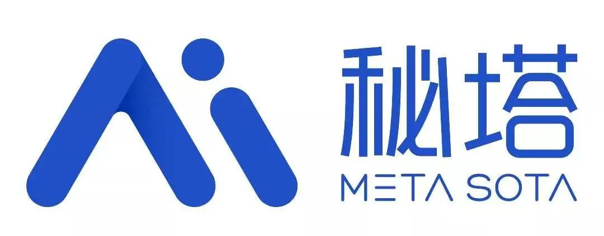

# AID Studio — AI Drama & Motion Comic Creation

**简体中文** | [English](README.en.md)

**AID Studio：开源 AI 漫剧创作平台，支持 AI 短剧、电影与漫画，从剧本、分镜到视频配音的一站式创作。**

Open-source, self-hosted AI drama and motion comic creation — from scripts and storyboards to video and voiceovers, with support for films and comics.

<p align="center">
  <a href="https://www.aidstudio.com.cn/"><strong>在线体验</strong></a>
  &nbsp;&nbsp;·&nbsp;&nbsp;
  <a href="#快速开始"><strong>开始部署</strong></a>
  &nbsp;&nbsp;·&nbsp;&nbsp;
  <a href="https://gzxxaitdb.feishu.cn/docx/LZ5zdesEgo1z4Mxc7OWc7zTHnJc"><strong>使用教程</strong></a>
  &nbsp;&nbsp;·&nbsp;&nbsp;
  <a href="https://github.com/gzxx-2025/aid-studio/releases"><strong>版本发布</strong></a>
  &nbsp;&nbsp;·&nbsp;&nbsp;
  <a href="SUPPORT.md"><strong>获取帮助</strong></a>
</p>

<p align="center">
  <a href="#产品预览">
    
  </a><br>
  <sub>流程画布实拍 · <a href="#产品预览">查看更多产品截图</a></sub>
</p>

## 交流与反馈

部署、模型配置、二次开发或创作流程接入遇到问题，可以通过[获取帮助](SUPPORT.md)中的入口反馈，或扫码加入交流群。

<p align="center">
  
</p>

<p align="center">
  <a href="references/community-qr.png">
    
  </a><br>
  <sub>如果二维码未直接显示，可点击二维码区域查看原图。</sub>
</p>

## 赞助商

| | |
|:---:|---|
| <a href="https://metaso.cn/minimax-h3/?s=aid-studio"></a> | **MiniMax H3 视频生成 API｜秘塔科技**<br>秘塔科技提供高性价比的 MiniMax H3 视频生成服务：**768P 仅 0.09 元/秒，2K 仅 0.15 元/秒**。支持原生 2K、音画同步，API 兼容 **OpenAI 协议**，同时支持 **ComfyUI**，无需自行部署 GPU。<br>🎁 通过 [aid-studio 专属链接注册](https://metaso.cn/minimax-h3/?s=aid-studio)，即可领取赠送额度及专属优惠。 |

## 核心能力

- **完整创作流程**：剧本、角色场景、分镜、图片、视频与配音围绕同一项目组织。
- **多模型接入**：按需配置文本、图片、视频和语音模型；能力以所选模型为准。
- **自行部署与管理**：支持 Docker / systemd 安装，配套模型、任务、用户和升级管理。

> 源码按 MIT 协议提供。AI 生成需要配置相应供应商的 API 凭证；模型调用、服务器和存储可能产生费用，生成效果取决于模型与输入素材。

[第一个漫剧项目](#第一个漫剧项目) · [开始部署](#快速开始) · [产品截图](#产品预览) · [技术与源码](#公开源码目录) · [文档导航](#文档导航)

## AID 用来做什么

以 **AI 漫剧与短剧创作**为核心，也支持电影化短片和静态漫画。创作者在同一个项目中管理剧本、分集、素材和生成结果；团队与开发者可自行部署并配置模型。

## 三大核心创作方向

| 创作方向 | 可以完成的工作 |
| --- | --- |
| **AI 漫剧 / 短剧** | 分集剧本、角色与场景资产、分镜图片、视频片段、角色配音与成片预览 |
| **AI 电影 / 短片** | 镜头规划、参考素材组织、视频生成与音画制作 |
| **AI 漫画** | 故事与角色设定、连续分镜画面、静态漫画素材管理 |

流程化创作与流程画布是两个独立入口，可按创作习惯选择；上方首图展示的是现有流程画布。

## 第一个漫剧项目

先跑通一个分镜，再扩展到整集：

1. **准备模型**：自行部署后，在后台配置文本、图片模型；需要视频和配音时，再配置对应模型。核对能力、凭证与费用后启用。
2. **建立项目**：准备一小段剧本，建立一个分集，并整理角色与场景。
3. **准备参考素材**：生成或上传有权使用的角色、场景图片。
4. **完成一个分镜**：检查分镜脚本和图片，再选择已配置的视频模型生成片段。
5. **配音与预览**：按需添加配音，检查画面和声音，再继续更多分镜。

只制作静态漫画时，无需执行视频和配音步骤。具体页面操作见[使用教程](https://gzxxaitdb.feishu.cn/docx/LZ5zdesEgo1z4Mxc7OWc7zTHnJc)；安装问题见[部署指南](deploy/README.md)，其他问题见[获取帮助](SUPPORT.md)。

## 功能特性

<details>
<summary>展开完整创作与平台能力</summary>

**AI 创作全流程**

- 剧本与分集：项目/剧本/分集管理，AI 辅助剧本创作与场景资产提取
- 角色/道具/场景：形象资产库、参考图管理、角色配音绑定
- 分镜工作台：分镜脚本生成、分镜图生成、镜头组拆分、视频提示词生成
- 图像生成：文生图、图生图、多图融合，参考图占位协议统一治理
- 视频生成：图生视频、首尾帧、多镜头批量出片，清晰度/时长/比例按模型能力校验
- 配音合成：TTS 多音色、音色库管理、对口型

**平台能力**

- 多厂商编排：文本、图片、视频和语音模型通过统一 Provider 接入，模型能力、参考图数量、分辨率、时长和比例均可配置
- API 网关配置：可按兼容协议配置模型访问地址与凭证，支持按模型设置例外
- 统一任务系统：生成任务排队、并发调度、进度推送、失败重试、补偿和结果回收
- 视觉一致性：角色、道具、场景资产复用，官方/自定义风格与项目风格快照，参考图按模型能力安全编排
- 计费体系：按模型/SKU 计费、余额冻结与结算、充值套餐、支付宝/微信支付
- 用户体系：账号/短信/邮箱/微信扫码登录、实名认证、邀请激励
- 运营管理：模型、供应商、智能体、提示词、内容、订单、用户、存储和平台配置统一管理
- 生产运维：Docker 与 systemd 两种部署方式、内外部中间件、HTTPS、配置备份、状态诊断和完整卸载
- 在线升级：页面与命令行均可检查更新、查看实时进度和执行回退，配套独立升级器 `aid-updater`

</details>

## 快速开始

### 生产部署

先准备一台全新的 64 位 Linux 服务器；不启用 RocketMQ、且中间件同机时，最低为 **2 核 / 4 GB 内存 / 40 GB 磁盘**。更多容量要求与安装选项见[部署指南](deploy/README.md)。

下面的命令会把安装脚本保存到 `/root/aid-install.sh`，优先从 Gitee 下载，失败后自动切换 GitHub；下载成功后才执行脚本。首次安装会先生成配置，**请检查并确认配置后再继续初始化和启动服务**。

```bash
cd /root && if command -v curl >/dev/null 2>&1; then curl -fL --retry 3 --connect-timeout 15 -o /root/aid-install.sh https://gitee.com/gzxx-2025/aid-studio/raw/master/deploy/aid.sh || curl -fL --retry 3 --connect-timeout 15 -o /root/aid-install.sh https://raw.githubusercontent.com/gzxx-2025/aid-studio/master/deploy/aid.sh; elif command -v wget >/dev/null 2>&1; then wget -O /root/aid-install.sh https://gitee.com/gzxx-2025/aid-studio/raw/master/deploy/aid.sh || wget -O /root/aid-install.sh https://raw.githubusercontent.com/gzxx-2025/aid-studio/master/deploy/aid.sh; else echo '请先安装 curl 或 wget'; exit 1; fi && sudo env AID_REMOTE_BOOTSTRAP=1 AID_RELEASE_CHANNEL=auto bash /root/aid-install.sh install
```

安装完成后运行 `sudo aid default` 查看访问地址，**首次登录立即修改管理员密码**。在后台配置并启用所需模型后，再按[第一个漫剧项目](#第一个漫剧项目)开始创作。

<details>
<summary>展开部署选项、资源要求与管理命令</summary>

`install` 是智能入口：未部署时默认进入 Docker 首次安装，已经部署时转入更新检查。也可以明确选择部署方式：

```bash
sudo env AID_REMOTE_BOOTSTRAP=1 AID_RELEASE_CHANNEL=auto bash /root/aid-install.sh install-docker
sudo env AID_REMOTE_BOOTSTRAP=1 AID_RELEASE_CHANNEL=auto bash /root/aid-install.sh install-manual
```

`auto` 优先选择正式版；没有可安装正式版时才回退到 Beta 并提示。需要固定正式渠道时改为 `stable`，明确测试预发布版本时才使用 `beta`。

| 部署方式 | 适合场景 | 配置真源 | 运行方式 |
|---------|---------|---------|---------|
| Docker（推荐） | 新服务器、希望中间件与运行环境隔离 | `/data/aid/config/docker.env` | Docker Compose |
| 手动部署 | 已有主机环境、宝塔或 systemd 运维体系 | `/data/aid/aid-deploy.conf` | systemd + Nginx |

首次部署会先生成配置并要求管理员检查确认；**配置未确认前不会拉取统一源码、构建程序、初始化数据库或启动服务**。部署器会优先使用国内源码、依赖和镜像线路，失败时回退官方地址；服务端、管理端、Web 端与升级器从同一个版本标签构建，完整日志写入 `/data/aid/logs/`。已存在且版本符合的依赖会直接复用，未完整下载的缓存会重新校验和下载。

Docker 模式支持内置或外部 MySQL 5.7、内置或外部 Redis、可选 RocketMQ、可选 HTTPS；配置外部 MySQL 后不会启动内置 MySQL。Redis 用户名、密码和数据库索引均可为空，RocketMQ 关闭时不会启动或校验 MQ，启用后可配置外部 NameServer 与 ACL。手动模式会按需准备 JDK、Git、Maven、Node.js、Go、Nginx、MySQL 5.7 和 Redis；外部中间件只做连通性校验，RocketMQ 由管理员自行准备。

HTTPS 需要用户域名、管理域名、443 端口以及完整证书链和私钥。证书默认放在 `/data/aid/config/ssl/`，也可在管理端「项目升级配置 → 运行配置」中上传证书、配置域名并分别测试 DNS、证书和 HTTPS。仅设置 `HTTP_PORT=443` 不会自动启用 TLS。

部署完成后使用统一命令管理两种安装方式：

| 命令 | 作用 |
|------|------|
| `sudo aid` | 打开交互式管理菜单 |
| `sudo aid default` | 查看公网/内网用户端、管理端地址及初始化账号说明 |
| `sudo aid status` | 检查服务、中间件和升级器状态 |
| `sudo aid logs` | 查看运行日志 |
| `sudo aid config` | 编辑当前部署配置并按提示生效 |
| `sudo aid restart` | 重新加载配置并重启服务 |
| `sudo aid update` | 检查并执行当前渠道更新 |
| `sudo aid progress` | 查看升级、升级器更新或回退的实时进度 |
| `sudo aid rollback` | 选择官方允许回退的历史版本 |
| `sudo aid backup` | 创建部署备份 |
| `sudo aid mysql` | 查看当前 MySQL 连接信息 |
| `sudo aid uninstall --keep` | 卸载程序但保留数据与配置 |
| `sudo aid uninstall --purge` | 经二次确认后完整清除 AID 数据 |

**服务器配置要求**（安装脚本自动检查，低于配置时提示当前配置并使用 `y/n` 确认）：

| 部署内容 | 最低配置 | 推荐配置 |
|---------|---------|---------|
| 本机 Docker 全栈（不启用 RocketMQ） | 2核 4G / 40G 磁盘 | 4核 8G / 100G+ 磁盘 |
| 本机 Docker 全栈（启用 RocketMQ） | 4核 4G / 40G 磁盘 | 6核 12G / 100G+ 磁盘 |
| 本机手动部署（中间件同机） | 2核 4G / 40G 磁盘 | 4核 8G / 100G+ 磁盘 |
| 本机手动部署（启用 RocketMQ） | 4核 4G / 40G 磁盘 | 6核 12G / 100G+ 磁盘 |

启用 RocketMQ 的 4核4G 最低值仅用于本机搭建和功能验证，需要使用收紧后的 JVM/MQ 参数；消息量较大、需要 MQ 派发时建议使用 6核12G 或更高配置。调优方法见[部署指南](deploy/README.md)「配置要求」一节；媒体文件强烈建议配置 OSS/COS 对象存储，本地磁盘仅作兜底。


</details>

<details>
<summary>展开本地开发与后台访问说明</summary>

### 本地开发

要求：JDK 17+、Maven 3.6+、Docker（起中间件用）。

```bash
# 1. 一键启动开发环境（MySQL + Redis，自动导入 sql/ 初始化脚本）
cd deploy/docker
docker compose -f docker-compose.middleware.yml up -d
# 需要联调 RocketMQ 时改用：
# docker compose -f docker-compose.middleware.yml --profile mq up -d

# 2. 构建并启动后端（开发默认配置与上述环境完全对齐，无需修改任何配置）
cd ../..
mvn clean package -DskipTests
java -jar aid-admin/target/aid-admin.jar
```

访问 `http://localhost:8080` 验证服务；数据库初始化管理员为 `admin / admin123`，首次登录后必须立即修改密码。

后端全部环境参数支持环境变量覆盖：`DB_*`、`REDIS_*`、`TOKEN_SECRET`（**生产必须注入强随机值**）、`AID_PROFILE`、`ROCKETMQ_ENABLED`（未部署 RocketMQ 时设 `false` 可完全关闭 MQ 装配，系统走本地任务模式）、`ROCKETMQ_NAMESERVER`。

### 默认访问与后台访问码

生产部署完成后，默认访问地址如下（实际端口和随机访问码以 `sudo aid default` 输出为准）：

| 入口 | 默认地址 | 说明 |
|------|---------|------|
| 用户端 | `http://服务器IP/` | 默认 80 端口，可通过 `HTTP_PORT` 调整 |
| 管理端 | `http://服务器IP:8089/<随机访问码>` | 默认 8089 端口，首次部署生成12位随机访问码并打印完整地址 |
| 后端接口 | `http://服务器IP:8080/` | 默认 8080 端口，通常由 Nginx 反向代理访问 |

管理端数据库初始化账号为 `admin / admin123`。首次部署不会使用公开的固定入口，安装器会生成 12 位随机访问码；首次登录后请立即修改管理员密码，并可在「全局业务配置 → 登录与认证 → 后台登录入口」重新生成访问码。`sudo aid default` 只展示初始化账号说明，不会反查或重置已经修改的管理员密码。

启用后台随机入口后，后台登录地址按下面规则拼接：

```text
http://服务器IP:8089/<访问码>
```

示例（实际访问码以部署完成后的输出为准）：

```text
http://localhost:8089/Ab12Cd34Ef56
```

如果配置了域名与 HTTPS，则同样把访问码追加到管理端站点根路径后：

```text
https://admin.example.com/Ab12Cd34Ef56
```

部署完成后，安装脚本会明确输出当前数据库中的完整后台登录地址。如遗忘访问码，可在数据库 `aid_config` 表中查询 `category = 'admin_entry'`、`config_name = 'access_code'` 的记录，或登录后重新生成并保存。


</details>

### 配置 AI 厂商

公开仓库中的管理端和用户创作端源码分别位于 [`frontend/admin`](https://github.com/gzxx-2025/aid-studio/tree/main/frontend/admin) 与 [`frontend/web`](https://github.com/gzxx-2025/aid-studio/tree/main/frontend/web)。启动后在后台「AI模型配置」中配置所需厂商的凭证、模型能力与计费规则，再启用模型。完成视频与配音流程时，还需配置对应的视频与语音模型。

## 产品预览

> README 中的图片均使用仓库相对路径引用，可在 Gitee / GitHub 两端直接渲染；如页面加载较慢，请稍等浏览器完成图片缓存。

### 用户端创作工作台

从项目创建、剧本创作、流程画布、角色与场景资产管理，到分镜生成、视频、配音和成片预览，用户端围绕 AI 漫剧、AI 电影与 AI 漫画组织为连续工作流。

<p align="center">
  
</p>

| 平台创作入口 | 我的作品 |
|-------------|---------|
|  |  |

| 项目配置与风格选择 | 流程化剧本创作 |
|-------------------|---------------|
|  |  |

| 流程画布 | 场景与素材管理 |
|---------|---------------|
|  |  |

| 画面编辑与参考素材 | 生成模型配置 |
|-------------------|-------------|
|  |  |

| 分镜设计 | 分镜视频管理 |
|---------|-------------|
|  |  |

| 多参数视频生成 | 音画同步管理 |
|----------------|-------------|
|  |  |

| 配音编辑 | 配音角色选择 |
|---------|-------------|
|  |  |

<p align="center">
  
</p>

### 管理端运营后台

管理端覆盖平台概览、用户与作品管理、AI 模型与供应商配置、任务监控、支付计费、系统升级等运营能力。

<p align="center">
  
</p>

| 数据概览 | 生成任务监控 |
|---------|-------------|
|  |  |

| 用户管理 | 内容详情审核 |
|---------|-------------|
|  |  |

| AI 模型配置 | AI 业务编排 |
|------------|-------------|
|  |  |

| 在线升级与版本说明 | 在线用户监控 |
|-------------------|-------------|
|  |  |

<p align="center">
  
</p>

## 公开源码目录

公开仓 `aid-studio` 是 AID 的统一源码与部署发布入口，包含服务端、管理端、用户创作端、版本清单、部署脚本、增量 SQL 和独立升级器。三端使用同一个版本标签。

公开源码统一发布到 [Gitee aid-studio](https://gitee.com/gzxx-2025/aid-studio) 和 [GitHub aid-studio](https://github.com/gzxx-2025/aid-studio)，两个平台使用相同提交和标签。

| 路径 | 内容 |
|------|------|
| `/` | Java 服务端、初始化 SQL、部署脚本与升级器 |
| `frontend/admin/` | 运营管理端（React） |
| `frontend/web/` | 用户创作端 |

从 `v1.0.1` 起，新版本统一使用本仓库的同名标签。历史版本的获取与迁移请先查阅对应发布说明；升级、备份与可用回退范围见[部署指南](deploy/README.md)。

## 官方资产包

AID 的初始化数据会引用一组官方媒体资源，用于首次部署后的平台展示和创作示例，包括角色、场景、道具、光影、景别/焦距、姿态、表情、特效、分镜示例、智能体与供应商图标、语音头像与 MP3 试听、首页图片及演示视频。该大体积资产包与程序源码分离，不会随 GitHub/Gitee Release 或一键部署自动下载，避免占用公共代码托管流量并防止误写部署方的 OSS/COS。

- 资产包只包含 `aid_init` 初始化库实际引用的官方文件，不包含用户生成内容、账号、密钥、日志或其他业务数据。
- 包内按 `files/aid/...` 保留数据库使用的原始对象键，可一次性导入本地存储、阿里云 OSS 或腾讯云 COS，无需批量改写初始化 SQL。
- 每个文件都记录在包内 `manifest.json` 和 `asset-checksums.txt` 中，可按路径、大小和 SHA-256 校验完整性。
- 获取入口与对应版本校验值由[官方运营站](https://www.aidstudio.com.cn/)及版本公告统一发布。请选择与程序版本一致的 `aid-official-assets_<版本>.tar.gz`，具体导入命令见包内 `README.md`。

## 系统架构

<details>
<summary>展开系统架构与技术栈</summary>

<p>
  
  
  
  
  
  <a href="https://github.com/gzxx-2025/aid-studio/actions/workflows/backend-build.yml"></a>
  <a href="https://github.com/gzxx-2025/aid-studio/actions/workflows/admin-build.yml"></a>
  <a href="https://github.com/gzxx-2025/aid-studio/actions/workflows/web-build.yml"></a>
</p>

```text
aid-studio（Maven 多模块单体）
├── aid-admin        Spring Boot 启动入口与配置
├── aid-common       公共组件（安全/缓存/存储/支付/短信适配）
├── aid-business     Web 层
│   ├── business-framework   Web框架、数据源、过滤器、AOP
│   ├── business-system      后台管理接口（/system /aid /aidconfig）
│   ├── business-main        C端接口（/auth /api/user /recharge）
│   ├── business-quartz      定时任务
│   └── business-generator   代码生成
├── aid-interface    领域层
│   ├── interface-core       核心接口
│   ├── interface-system     实体、Mapper、系统服务
│   └── interface-main       业务服务（媒体/分镜/计费/升级等）
├── aid-consumer     MQ 消费者
├── deploy/updater   独立升级器（Go）
└── frontend
    ├── admin        运营管理端（React）
    └── web          用户创作端
```

调用链：`Controller → Service → Mapper → MySQL`，媒体生成经统一编排层路由到各厂商 Provider。

## 技术栈

| 维度 | 技术 | 版本 |
|------|------|------|
| 语言 | Java | 17 |
| 框架 | Spring Boot | 3.5.x |
| ORM | MyBatis-Plus | 3.5.x |
| 数据库 | MySQL | 5.7 |
| 缓存 | Redis + Redisson | 3.x |
| 消息队列 | RocketMQ | 4.x/5.x |
| 定时任务 | Quartz | 2.5.x |
| 对象存储 | 阿里云 OSS / 腾讯云 COS | - |
| 接口文档 | SpringDoc OpenAPI | 2.8.x |
| 升级器 | Go | 1.22 |

</details>

## 文档导航

| 文档 | 说明 |
|------|------|
| [部署指南](deploy/README.md) | Docker / systemd 部署、配置项、HTTPS、中间件、升级、回退与卸载 |
| [English guide](README.en.md) | English overview, installation, first project and maintenance |
| [贡献指南](CONTRIBUTING.md) | 问题报告、改动范围、开发验证与 PR 提交 |
| [公开 Provider 接入指南](doc/公开Provider接入指南.md) | 文本 / 图片 / 视频 / 语音 Provider 入口、能力声明、统一任务与计费、官方协议核验与提交检查（[English](doc/public-provider-integration.md)） |
| [获取帮助](SUPPORT.md) | 使用、部署和模型配置问题的反馈入口 |
| [安全报告](SECURITY.md) | 私密报告漏洞，避免公开敏感细节 |
| [社区行为准则](CODE_OF_CONDUCT.md) | 交流与协作约定 |
| Swagger 接口文档 | 启动后访问 `http://localhost:8080/swagger-ui.html`（生产环境默认关闭） |

## 在线升级

管理端「系统管理 → 项目升级配置」和命令行使用同一套独立升级器。页面会展示当前版本、线上版本、双语版本说明、升级器状态、可回退版本以及黑色实时终端；任务执行期间禁止重复提交，低于 4 核 4G 时会在确认升级前给出高风险提醒。

升级流程会先确认升级器版本，升级器落后时必须先升级升级器；随后校验签名清单和统一仓库版本标签，完成配置与数据库备份、本机三端源码构建、增量 SQL、程序替换和健康检查。新增配置只会补入缺失项，原有配置值保持不变并在同目录生成备份；失败时按安全边界自动恢复程序与配置。升级期间可在页面或执行 `sudo aid progress` 查看同一份实时日志，按 `q` 退出查看不会中断后台任务。

更新会进行三端编译、数据库备份和健康检查，短时间内可能明显占用 CPU、内存和磁盘 I/O。生产环境应先做异机备份并在业务低峰执行；Beta 版本建议先在测试环境验证。完整升级、SQL 与回退规则见[部署指南](deploy/README.md)。

## 参与贡献

欢迎中文或英文 Issue 与 Pull Request。先阅读[贡献指南](CONTRIBUTING.md)、[公开 Provider 接入指南](doc/公开Provider接入指南.md)与[社区行为准则](CODE_OF_CONDUCT.md)，再选择适合自己的贡献：复现问题、改进文档、修复缺陷或适配公开模型协议。

- [报告问题 / 提出建议](https://github.com/gzxx-2025/aid-studio/issues/new/choose)
- [查找适合首次贡献的任务](https://github.com/gzxx-2025/aid-studio/issues?q=is%3Aissue%20is%3Aopen%20label%3A%22good%20first%20issue%22)
- [报告安全问题](SECURITY.md)

如果 AID 对你有帮助，欢迎 Star 收藏，也欢迎分享有权公开的创作案例和部署经验。

## 开源协议

本项目基于 [MIT License](LICENSE) 开源，版权归光子讯息(杭州)科技有限公司所有。第三方归属说明见 [NOTICE](NOTICE)，原有版权与许可声明予以保留。

## 鸣谢

后台管理框架部分基于 [RuoYi-Vue](https://gitee.com/y_project/RuoYi-Vue)（MIT License）二次开发，特此致谢。

| 社区 | 鸣谢 |
|------|------|
| <a href="https://linux.do/"></a> | 感谢 [Linux.do](https://linux.do/) 社区为中文技术交流与开源生态建设提供的支持。 |
